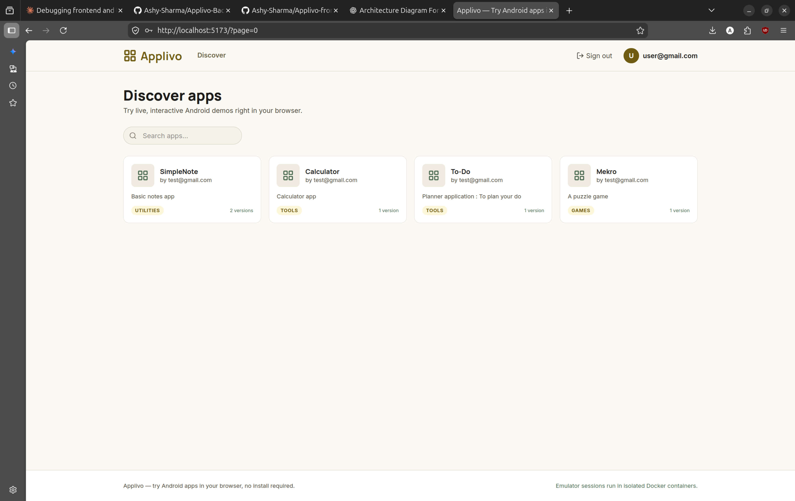
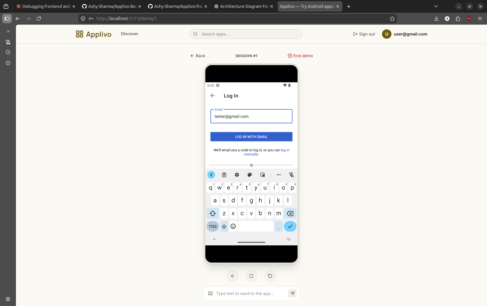
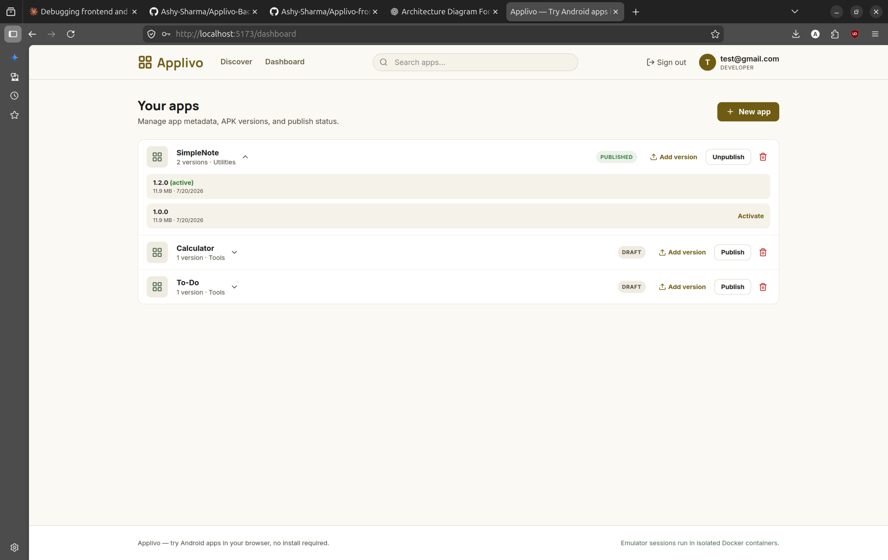
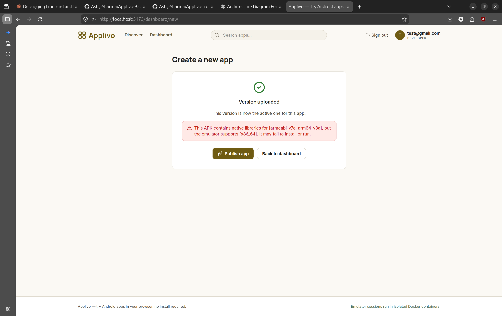

# Applivo — Backend

Try Android apps live in your browser. Upload an APK, get a shareable link, and anyone can interact with the real app — running in an isolated Android emulator — with no install required.

**Frontend repo:** [Applivo-frontend](https://github.com/Ashy-Sharma/Applivo-frontend)

> This is one half of a two-repo project. This repo is the Spring Boot backend: authentication, app/version management, and Android emulator orchestration. The React client lives in the frontend repo above.

---

## Screenshots


| Discover | Live Demo Session |
|---|---|
|  |  |

| Developer Dashboard | Upload with Compatibility Warning           |
|---|---------------------------------------------|
|  |  |

---

## What it actually does

A developer registers, uploads an APK, and publishes it. Any signed-in user can then click "Try Demo" — the backend spins up a real Android emulator inside a Docker container, installs and launches the APK, and streams the screen to the browser over WebSocket at a few frames per second. Taps, swipes, text input, and hardware keys (back/home/recent) sent from the browser are translated into ADB commands executed against the emulator, live.

## Architecture

```text
                                    Browser (React)
                                 /                  \
                               HTTP               WebSocket 
                              (REST)            (STOMP/SockJS)
                                |                    |
                                +--------+-----------+
                                         |
                                         v
              +---------------------------------------------------+
              |                   Spring Boot Backend             |
              |                                                   |
              |          JWT Auth → Controllers → Services        |
              |                          |                        |
              |          +---------------+----------------+       |
              |          |               |                |       |
              |          v               v                v       |
              |     JPA / MySQL    Docker Java API    WebSocket   |
              |     (all state)    (emulator mgmt)     Messaging  |
              +----------+---------------+------------------------+
                         |               |
                         v               v
                MySQL (Flyway)     Docker Engine
                                         |
                                         v
                              Android Emulator Container
                               (budtmo/docker-android)
                                         |
                                         v
                                  ADB Operations
              (Install APK • Tap • Swipe • Text Input • Screenshot)
```

**No Redis, no message queue, no microservices.** Session and emulator state live entirely in MySQL. This is a deliberate scope decision for a single-instance deployment, not an oversight — see [Known Limitations](#known-limitations).

## Tech stack

| Layer | Technology |
|---|---|
| Language / runtime | Java 17, Spring Boot |
| Auth | Spring Security, JWT (access + refresh tokens, refresh rotation, access-token blacklist on logout) |
| Persistence | MySQL 8, Spring Data JPA/Hibernate, Flyway migrations |
| Emulator orchestration | Docker Java API (`docker-java`), [`budtmo/docker-android`](https://hub.docker.com/r/budtmo/docker-android) |
| Device control | ADB, executed via `docker exec` |
| Real-time | Spring WebSocket, STOMP over SockJS |
| APK inspection | [`apk-parser`](https://github.com/hsiafan/apk-parser) for package name + native library (ABI) extraction |
| File storage | Local filesystem (interface-based, swappable for S3 later) |
| Containerization | Docker, Docker Compose, multi-stage `Dockerfile` |

## Features

**Auth**
- Register / login / refresh / logout / logout-all
- BCrypt password hashing
- Short-lived JWT access tokens + long-lived refresh tokens, refresh tokens hashed at rest and rotated on use
- Access tokens are blacklisted (DB-backed) on logout, so a logged-out token can't be replayed until it naturally expires

**Apps & versions**
- Full app CRUD with ownership enforcement (a developer can only modify their own apps)
- Publish / unpublish, gated on having at least one active version
- APK upload with:
  - Extension, size, and content validation
  - Automatic package name extraction from the APK manifest
  - **ABI compatibility check** — the uploaded APK's native libraries are compared against the emulator's actual supported architecture (`x86_64`); an incompatible APK still uploads, but the developer gets a warning explaining why it may fail to install or run, instead of finding out later with no explanation
  - Single active version per app, with a safety check preventing deletion of the only active version of a published app
- Full-text search over published apps (MySQL `FULLTEXT` index)

**Live demo sessions**
- One active session per user at a time
- Session creation is async: the API returns immediately while the emulator boots in the background, so the request doesn't block on a multi-minute container start
- APK install failures are diagnosed, not swallowed — if `pm install` fails (e.g. `INSTALL_FAILED_NO_MATCHING_ABIS`), the actual reason is captured from stderr and surfaced back to the end user via the session status endpoint, instead of a generic "session failed"
- App is auto-launched after install (`monkey` + launcher intent) — no manual navigation required
- Live status polling endpoint reports `CREATING` / `ACTIVE` / `FAILED` / `ENDED` / `TIMED_OUT` with a human-readable message

**Real-time streaming & interaction**
- WebSocket connections authenticated via JWT on the STOMP `CONNECT` frame
- Screenshots captured with a single `adb exec-out screencap -p` call (binary stdout streamed directly, no intermediate file I/O) and broadcast to the session's topic
- Tap, swipe, text input, and hardware key events from the browser are mapped to ADB commands and executed on the live emulator

**Lifecycle & cleanup**
- Scheduled health checker detects dead/crashed containers and marks sessions accordingly
- Idle sessions (no interaction for 5 minutes) are automatically cleaned up
- Ending a session stops and removes its container

**Deployment**
- Multi-stage `Dockerfile` (Maven build stage → slim JRE runtime stage)
- `docker-compose.yml` for backend + MySQL, fully configured via environment variables
- No secrets committed — `.env.example` documents every required variable

## Known limitations

Documented honestly rather than hidden:

- **Single concurrent session by default** (`EMULATOR_MAX_CONCURRENT_SESSIONS`, defaults to 1). Raising this is a config change, but each emulator needs real CPU/RAM/KVM headroom — this isn't horizontally scaled.
- **Architecture-specific APKs may not run.** The emulator image runs `x86_64`. APKs shipping only ARM native libraries (common for game engines / apps with native code) will fail to install. This is detected and flagged at upload time and, if it happens anyway, the real failure reason is surfaced — but there's no ARM emulation fallback.
- **Emulator boot time is variable**, typically 1.5–4 minutes depending on host load, since there's no pre-warmed container pool. Session creation is async specifically so this doesn't block the API, but the user does wait.
- **No Redis / single-instance state.** All session and emulator state lives in MySQL. This is fine at the scale this was built for, but the app isn't currently designed to run as multiple horizontally-scaled instances.
- **Analytics and admin dashboards are not implemented.** Cut to prioritize the core demo pipeline (upload → live interactive session) within the build timeline. The `ADMIN` role exists in the schema but has no backing endpoints yet.
- **Local filesystem storage only** — no S3/cloud storage integration yet.

## Project structure

```
src/main/java/com/projects/applivo/
├── config/          # Security, CORS, Docker client, storage, application beans
├── controller/       # REST endpoints (Auth, App, Version, Session, Public)
├── dto/              # Request/response DTOs
├── entity/           # JPA entities
├── repository/        # Spring Data repositories
├── service/           # Business logic (auth, apps, versions, sessions)
├── security/         # JWT generation/validation, refresh token handling
├── emulator/          # Docker container lifecycle, ADB command execution,
│                     #   screenshot streaming, health checking
├── websocket/          # STOMP config, auth interceptor, message handlers
├── storage/           # File storage abstraction (local implementation)
├── mapper/            # Entity ↔ DTO mapping
├── exception/          # Custom exceptions + global handler
└── util/              # Security context helpers, hashing
```

## Running it locally

### Prerequisites

- Docker & Docker Compose
- A Linux host with KVM support (`/dev/kvm` present) for usable emulator performance — this is a hard requirement, not optional, per the [Android emulator's own virtualization needs](https://developer.android.com/studio/run/emulator-acceleration)

### Setup

```bash
git clone https://github.com/Ashy-Sharma/Applivo-Backend.git
cd Applivo-Backend

cp .env.example .env
```

Edit `.env` and set a real `JWT_SECRET` (never reuse the example value):
```bash
openssl rand -base64 64
```

Then:
```bash
docker compose up --build
```

Verify it's up:
```bash
curl http://localhost:8080/api/public/apps
# {"content":[],"empty":true, ...}
```

### Running the frontend

See the [frontend repo](https://github.com/Ashy-Sharma/Applivo-frontend) — it runs separately via `npm run dev` and talks to this backend over `http://localhost:8080` by default.

## API overview

| Area | Examples |
|---|---|
| Auth | `POST /api/auth/register`, `/login`, `/refresh`, `/logout` |
| Apps | `POST /api/apps`, `GET /api/apps/my`, `PUT/DELETE /api/apps/{id}`, `POST /api/apps/{id}/publish` |
| Versions | `POST /api/apps/{appId}/versions` (multipart upload), `GET`, `PUT .../activate`, `DELETE` |
| Public | `GET /api/public/apps`, `GET /api/public/apps/{id}`, `GET /api/public/apps/search` |
| Sessions | `POST /api/sessions`, `GET /api/sessions/{id}/status`, `DELETE /api/sessions/{id}` |
| WebSocket | `/ws` (SockJS/STOMP) — subscribe `/topic/demo/{sessionId}`, send to `/app/demo/{sessionId}/interact` |

## Roadmap

Cut from this build's scope, tracked for later:
- Automated test suite (unit + integration)
- Icon / avatar upload
- Analytics dashboard for developers
- Admin panel
- Pre-warmed emulator pool to reduce session start time
- Cloud (S3) storage for APKs

## License

MIT — see [LICENSE](LICENSE).
